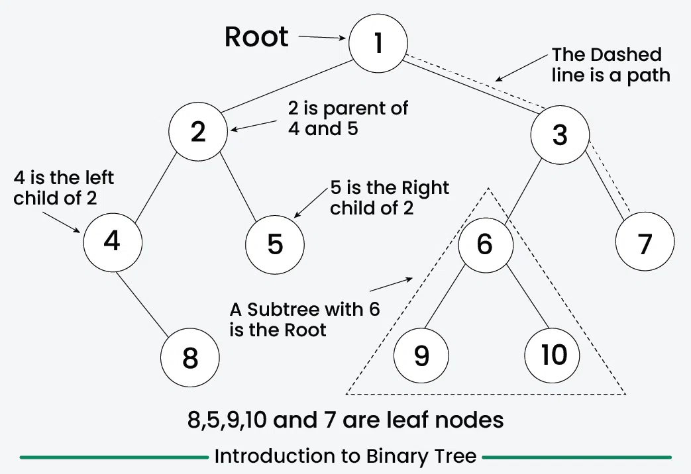

# Class 10: Binary Tree

**Date:** April 16, 2026

---

Set -> Relation -> Binary Relation -> Graph -> Tree -> Binary Tree

Reference Based
Array Based

Biary Tree has no circuit
Can have only 2 children

Left child and Right child matters

`Internal nodes` are nodes which have at least 1 child
If a node has no child, it is called a `leaf node`

**Binary Search Tree:** Node is placed on the tree is based on key value, all left child has value less than root, and all right child has value more than root. This includes sub-trees
